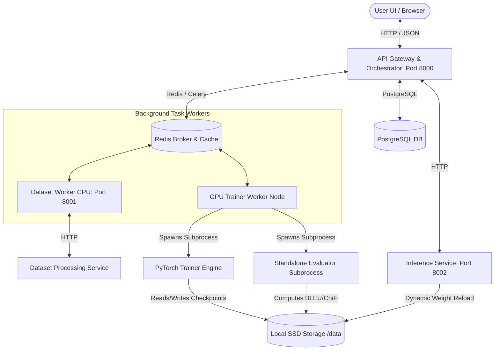

# AI Translator: End-to-End Multilingual Translation Lifecycle Platform

AI Translator is a production-grade, microservice-based lifecycle automation platform for multilingual translation model development. It provides full pipeline orchestration—from raw dataset ingestion, character-level filtering, deduplication, and immutable version lineage, to asynchronous parameter-efficient fine-tuning on GPU nodes, isolated evaluation telemetry, and real-time model serving with dynamic weight reloading.

---

## 🏗️ System Architecture

The platform is designed around a decoupled, microservices-oriented architecture:



---

## 🔬 In-Depth Component Workings

### 1. Central API Gateway & Orchestrator (FastAPI)
The Orchestrator acts as the central state ledger and command gateway. It provides transactional state management using PostgreSQL (SQLAlchemy) and distributes tasks using Celery.

* **State Ledger & Transitions**: Every operation (Dataset processing, validation, training execution) is logged as a transaction. State transitions are verified by a central state machine (`StateManager` class) that writes audit trails to the `state_transitions` table to ensure database consistency.
* **API Routing**:
  * `POST /jobs/submit`: Accepts training hyperparameter configs, validates inputs against Pydantic schemas, and enqueues Celery tasks.
  * `POST /jobs/{job_id}/pause`: Places a `.signal` file on disk to trigger graceful shutdown in the trainer.
  * `POST /jobs/{job_id}/resume`: Resolves the historical experiment run, updates database flags back to `Queued`, and re-schedules the task.
  * `POST /models/{model_id}/evaluate`: Triggers an asynchronous evaluation Celery task on the GPU worker.

---

### 2. Distributed GPU Scheduler & Lock Coordinator
To prevent concurrent GPU execution spikes on shared workstations (such as laptop CUDA devices with limited VRAM), the platform implements a distributed locking coordinator.

* **Redis-Based GPU Lock**: The class `gpu_scheduler` uses Redis to enforce mutual exclusion. When a Celery worker initiates a GPU training or evaluation task, it must call `gpu_scheduler.acquire_lock(job_id)`.
* **Task Queuing**: If the GPU lock is already held by another job, the Celery task yields and is placed back in the queue.
* **Serving Co-existence (CPU Fallback)**: The inference service runs on **CPU by default**. This ensures that translation inference APIs remain online 24/7 with zero VRAM competition, keeping the GPU's memory pool completely available for training.

---

### 3. Parameter-Efficient Fine-Tuning (PEFT) Engine
The training loop utilizes Hugging Face Accelerate and PEFT (Parameter-Efficient Fine-Tuning) to support multiple training modes:

* **Full Fine-Tuning**: Trains all model parameters in mixed-precision (FP16).
* **LoRA (Low-Rank Adaptation)**: Freezes the base model and injects low-rank trainable weight matrices into attention layers (query, value projection layers), cutting down trainable parameter counts by 99% while preserving performance.
* **QLoRA (Quantized Low-Rank Adaptation)**: Loads the base model in 4-bit precision using **NormalFloat4 (NF4)** weight quantization with double-quantization. Trainable LoRA matrices are attached on top of the quantized layers. This enables fine-tuning 600M+ parameter translation models (like NLLB-200) on consumer laptop GPUs (e.g. RTX 4050 6GB VRAM) with minimal memory footprint.

---

### 4. Isolated Subprocess Evaluation Engine (sacreBLEU & ChrF)
To ensure complete system stability and prevent GPU memory leaks, translation evaluation is isolated:

* **Subprocess Isolation**: Spawning evaluation directly within the Celery worker process would leave PyTorch's heavy **CUDA context** stuck in VRAM indefinitely. The platform resolves this by spawning `training/evaluator.py` as an independent subprocess.
* **Process Exit Cleanup**: Once the evaluation is finished, the subprocess exits completely, causing the OS to automatically destroy its CUDA context and free **100% of the VRAM**.
* **Metrics Computed**:
  * **sacreBLEU**: Word-level n-gram overlap precision score.
  * **ChrF**: Character-level n-gram F-score, which is highly accurate and robust for morphologically rich Indian languages (like Kannada and Malayalam).
* **UI Integration**: The UI displays live evaluation indicators (`⏳ Evaluating...`), auto-polls the database every 3 seconds for updates, and displays final score badges (green BLEU/cyan ChrF) in the registry.

---

### 5. Host-to-Container Shared Hugging Face Cache
To prevent redundant downloads of massive translation weights (e.g. 2.46 GB for NLLB-200) when rebuilds or reloading occur:
* The `docker-compose.yml` mounts the Windows host Hugging Face cache directory `C:/Users/swaro/.cache/huggingface` to the container path `/root/.cache/huggingface`.
* The local Celery workers and Docker container instances share a single source of truth, optimizing initialization speed from minutes to seconds.

---

### 6. Security Baseline (PyTorch 2.6 + CUDA 12.4)
The local host virtual environment is upgraded to PyTorch `2.6.0+cu124` to comply with Hugging Face's security policies regarding the loading of pickle-based checkpoint formats (**CVE-2025-32434**), preventing code execution vulnerabilities while utilizing GPU acceleration natively.

---

## 📁 Directory Structure

```
.
├── backend/                   # Central API Gateway & State Management (FastAPI)
│   ├── app/
│   │   ├── core/              # DB Session, GPU Scheduler, State Manager
│   │   ├── models/            # SQLAlchemy database schemas
│   │   └── routes/            # API endpoints (Experiments, Registry, Jobs)
│   └── Dockerfile
├── dataset_service/           # Unicode cleaning and dataset versioning service
│   ├── app/
│   │   ├── cleaning/          # Character-level NFKC clean pipelines
│   │   ├── validation/        # Language matchers (Kannada/Malayalam)
│   │   └── routes/            # Datasets endpoints
│   └── Dockerfile
├── inference/                 # Translation translation wrapper (served on CPU)
│   ├── app/
│   │   └── translator.py      # Translation models loading & generation
│   └── Dockerfile
├── training/                  # Accelerated PyTorch Trainer & Evaluator Engine
│   ├── trainer.py             # Training loop, telemetry metrics & checkpointing
│   └── evaluator.py           # Standalone subprocess model evaluator (BLEU/ChrF)
├── workers/                   # Background Celery task definitions
│   └── tasks.py               # Dataset processing, training & evaluation wrappers
├── monitoring/                # Prometheus & Grafana configs
├── docker-compose.yml         # Dev environment container orchestrator
├── evaluate_model.py          # Interactive command-line evaluator script
└── README.md
```

---

## ⚡ Setup & Run Instructions

### 1. Spin Up Core Infrastructure
Run PostgreSQL, Redis, Prometheus, and Grafana via Docker Compose:
```bash
docker compose up -d db redis prometheus grafana
```

### 2. Configure Python Environment & Dependencies
Create and activate your virtual environment:
```bash
python -m venv .venv
source .venv/bin/activate  # Windows: .venv\Scripts\activate

# Install dependencies for all components
pip install -r backend/requirements.txt
pip install -r dataset_service/requirements.txt
pip install -r training/requirements.txt
```

### 3. Launch Local Microservices
Start each service in a separate terminal:
```bash
# Tab 1: Central Orchestrator
uvicorn backend.app.main:app --host 0.0.0.0 --port 8000 --reload

# Tab 2: Dataset Service
uvicorn dataset_service.app.main:app --host 0.0.0.0 --port 8001 --reload

# Tab 3: Inference API
uvicorn inference.app.main:app --host 0.0.0.0 --port 8002 --reload

# Tab 4: Celery Task Worker
celery -A workers.tasks.celery_app worker -Q dataset,training --pool=solo --loglevel=info
```

### 4. Run Frontend Dashboard
```bash
cd frontend
npm install
npm run dev
```
Access the interface at `http://localhost:5173`.

