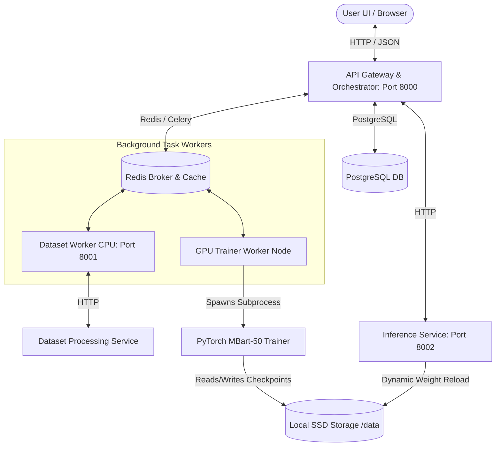

# AI Translator: End-to-End Multilingual Translation Lifecycle Platform

AI Translator is a production-grade, microservice-based lifecycle automation platform for multilingual translation model development. It provides full pipeline orchestration—from raw dataset ingestion, character-level filtering, deduplication, and immutable version lineage, to asynchronous model training on hardware nodes, real-time telemetry monitoring, and model serving with dynamic weight reloading.

---

## 🏗️ System Architecture

The platform is designed around a decoupled, microservices-oriented architecture:



---

## 🔬 In-Depth Component Workings

### 1. Central API Gateway & Orchestrator (FastAPI)
The Orchestrator acts as the central state ledger and command gateway. It provides transactional state management using PostgreSQL (SQLAlchemy) and distributes tasks using Celery.

* **State Ledger & Transitions**: Every operation (Dataset processing, validation, training execution) is logged as a transaction. State transitions are verified by a central state machine (`StateManager` class) that writes audit trails to the `state_transitions` table to ensure database consistency.
* **API Routing**:
  * `POST /jobs/submit`: Accepts training hyperparameter configs, validates inputs against Pydantic schemas, and enqueues Celery tasks.
  * `POST /jobs/{job_id}/pause`: Places a `.signal` file on disk to trigger graceful shutdown in the trainer.
  * `POST /jobs/{job_id}/resume`: Resolves the historical experiment run using name patterns (e.g. matching `run-{job_id[:8]}%`), updates database flags back to `Queued`, and re-schedules the task.

---

### 2. Distributed GPU Scheduler & Lock Manager
To prevent concurrent GPU execution spikes on shared workstations (such as laptop CUDA devices with limited VRAM), the platform implements a distributed locking coordinator.

* **Redis-Based GPU Lock**: The class `gpu_scheduler` uses Redis to enforce mutual exclusion. When a Celery worker initiates a GPU training task, it must call `gpu_scheduler.acquire_lock(job_id)`.
* **Task Queuing**: If the GPU lock is already held by another job, the Celery task yields and is placed back in the queue.
* **Serving Co-existence (CPU Fallback)**: The inference service runs on **CPU by default**. This ensures that translation inference APIs remain online 24/7 with zero VRAM competition, keeping the GPU's memory pool completely available for training.

---

### 3. Immutable Dataset Cleaning & Versioning Service
The Dataset Service manages character normalizations and lineage trees.

* **Unicode Normalization**: Raw inputs are processed using **Unicode NFKC normalization** to eliminate variations in character representations.
* **Character-Level Language Range Filters**:
  * **Kannada Matcher**: Detects text inside the Kannada Unicode block `\u0c80-\u0cff` and validates character density.
  * **Malayalam Matcher**: Detects text inside the Malayalam Unicode block `\u0d00-\u0d7f`.
* **Cryptographic Deduplication**: Generates an MD5 hash of clean source-target sentence pairs. Duplicate records are dropped before committing.
* **Version Tree Lineage**: Every processed dataset version stores a `parent_id` foreign key. This establishes an immutable version history tree, letting developers trace how a dataset evolved across cleaning stages.

---

### 4. PyTorch Training Engine & Checkpointing
The training loop utilizes Hugging Face Accelerate to run mixed-precision training.

* **Mixed Precision (FP16)**: Computes forward and backward passes in 16-bit floating point, using a `GradScaler` to scale loss values dynamically and prevent underflow in small gradients.
* **Graceful Pause Mechanics**:
  When a pause signal is received:
  1. The training loop catches the signal at the batch boundary.
  2. It invokes `accelerator.save_state()`, saving:
     - Model weights (`model.safetensors`)
     - Optimizer momentum buffers (`optimizer.bin`)
     - Learning rate scheduler parameters (`scheduler.bin`)
     - RNG states (`random_states_0.pkl`) for PyTorch, NumPy, Python, and CUDA (preserving dropout and shuffling consistency)
     - Dataloader sampler indices (`sampler.bin`)
  3. Writes training telemetry (`epoch`, `step`, `global_step`) to `pause_meta.json`.
  4. Releases VRAM cleanly: Calls `gc.collect()` and `torch.cuda.empty_cache()` to release the CUDA memory context.
* **Resuming with Dataloader Skip Loop**:
  Upon relaunch, the engine loads all states using `accelerator.load_state()`. To avoid duplicate computations on already processed data:
  ```python
  for step, batch in enumerate(train_dataloader):
      if epoch == resume_epoch and step <= resume_step:
          continue  # Fast-forward past completed batches without running CUDA graphs
  ```

---

### 5. Dynamic Inference Service with Zero-Downtime Reloading
The Inference Service runs independently of the training microservice.

* **Isolation**: Decoupled Flask/FastAPI app running on CPU, serving translation models.
* **Dynamic Weight Reloading**:
  When a model is approved in the registry:
  1. The orchestrator hits `POST /reload` on the inference service.
  2. The inference service spawns a separate thread to load the new weights (`.safetensors`) from the registry path into system RAM.
  3. It swaps the active generator model reference atomically, ensuring zero-downtime serving.

---

### 6. Hardware Telemetry & Monitoring
The system provides continuous metrics collections for hardware status tracking.

* **Telemetry Worker**: A daemon thread queries system usage every 2 seconds via `psutil` (CPU usage, system RAM) and `GPUtil` (GPU utility, VRAM allocation).
* **APIs & Export**: Metrics are pushed to the Redis cache (to update the frontend progress panels in real-time) and exposed to a `/metrics` endpoint.
* **Monitoring Stack**: Prometheus polls `/metrics` periodically, saving data to time-series databases. Grafana reads Prometheus to visualize historical resource trends.

---

## 📁 Directory Structure

```
.
├── backend/                   # Central API Gateway & State Management (FastAPI)
│   ├── app/
│   │   ├── core/              # DB Session, GPU Scheduler, State Manager
│   │   ├── models/            # SQLAlchemy database schemas
│   │   └── routes/            # API endpoints (Experiments, Registry, Jobs)
│   └── Dockerfile
├── dataset_service/           # Unicode cleaning and dataset versioning service
│   ├── app/
│   │   ├── cleaning/          # Character-level NFKC clean pipelines
│   │   ├── validation/        # Language matchers (Kannada/Malayalam)
│   │   └── routes/            # Datasets endpoints
│   └── Dockerfile
├── inference/                 # Translation translation wrapper (served on CPU)
│   ├── app/
│   │   └── translator.py      # Translation models loading & generation
│   └── Dockerfile
├── training/                  # Accelerated PyTorch Trainer Engine
│   └── trainer.py             # Training loop, telemetry metrics & checkpointing
├── workers/                   # Background Celery task definitions
│   └── tasks.py               # Dataset processing & training wrappers
├── monitoring/                # Prometheus & Grafana configs
├── docker-compose.yml         # Dev environment container orchestrator
└── README.md
```

---

## ⚡ Setup & Run Instructions

### 1. Spin Up Core Infrastructure
Run PostgreSQL, Redis, Prometheus, and Grafana via Docker Compose:
```bash
docker compose up -d db redis prometheus grafana
```

### 2. Configure Python Environment & Dependencies
Create and activate your virtual environment:
```bash
python -m venv .venv
source .venv/bin/activate  # Windows: .venv\Scripts\activate

# Install dependencies for all components
pip install -r backend/requirements.txt
pip install -r dataset_service/requirements.txt
pip install -r training/requirements.txt
```

### 3. Launch Local Microservices
Start each service in a separate terminal:
```bash
# Tab 1: Central Orchestrator
uvicorn backend.app.main:app --host 0.0.0.0 --port 8000 --reload

# Tab 2: Dataset Service
uvicorn dataset_service.app.main:app --host 0.0.0.0 --port 8001 --reload

# Tab 3: Inference API
uvicorn inference.app.main:app --host 0.0.0.0 --port 8002 --reload

# Tab 4: Celery Task Worker
celery -A workers.tasks.celery_app worker -Q dataset,training --pool=solo --loglevel=info
```

### 4. Run Frontend Dashboard
```bash
cd frontend
npm install
npm run dev
```
Access the interface at `http://localhost:5173`.
